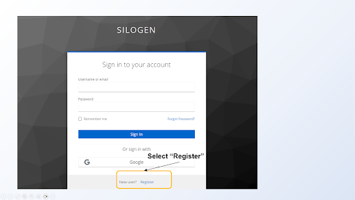

# Registering a New User

New users need to sign up for a Silogen Keycloak account. With the account, users can sign in to the Chat UI or get an access token to use with the API.

- Go to https://auth.services.silogen.ai/realms/silogen/account/ (figure 1)
- Select “Sign In”, and then select “Register” (figure 2)
  - Register with your company email
- You will receive a confirmation email with confirmation link, the link is valid only 5 min - Go to chat.services.silogen.ai and sign in with your account. After that your account is active and you can proceed with Chat UI or the API
  The screenshots on the next page show you this registering process.

_Figure 1. Keycloak account manager: https://auth.services.silogen.ai/realms/silogen/account/_

_Figure 2. Register or sign in to your siloGen account_
