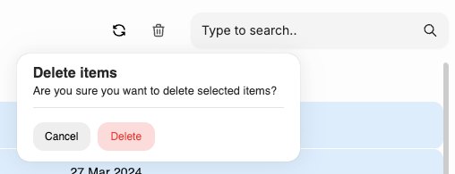

# Collection Management

Silogen provides an out-of-the-box component to assist with indexing and retrieving your documents in Collections as part of Retrieval Augmented Generation (RAG). You can manage your collections through [Collections page](https://chat.services.silogen.ai/console/collections) of the Developer Console.

## Creating a collection

Create a collection by clicking the "Create" button, which will allow you to specify the name of the collection and the embeddings server to use to index the documents of the collection. Reach out to your customer success manager to understand which embeddings server to use for your use case.

You can also optionally customize the chunking configuration of your collection: every document indexed in the collection will follow the configuration you specify. We do not allow changing the chunking configuration of a collection once it is created.

## Uploading documents to a collection

Once you have created a collection, you can upload documents to it. You can upload individual documents, a ZIP file of documents, or scrape a website into a collection.

### Upload documents

Select the collection you want to upload the document to, and click on the "Upload" button.
You can drag and drop the documents you want to upload, we currently support txt, pdf, doc, docx, ppt and pptx file formats. You can also upload **a single ZIP file** which contains multiple documents with the format specified.

If you choose to upload a ZIP file, the documents will be extracted and uploaded to the collection. You will be navigated to the "Jobs" tab of the page to monitor the progress of the ZIP file upload.

### Scrape a website into a collection

You can alternatively scrape the contents of a website into a collection. To do this, click on the "Scrape Website" button, and enter the URL of the website you want to scrape. You can also specify the number of pages to scrape from the website.
The web scraping process will begin from the website you specify and then traverse all links, which begin with the specified URL.
You can alternatively specify the URL to a sitemap.xml file, and the contents of the sitemap will be scraped into the collection.

You can navigate to the "Jobs" tab of the page to monitor the progress of the scrape website job.

### Deleting documents from the collection

You can delete documents that you upload to the collection, by selecting the documents in the "Documents" tab and clicking on the "Delete" button.

## Using your document in the Developer Console Chat

Once your collection has been created, it will be visible to members of your organization in the Developer Console [Chat page](https://chat.services.silogen.ai/console/chat) and the [Compare page](https://chat.services.silogen.ai/console/chat) to use as part of Retrieval Augmented Generation.

You can always choose to disable RAG for the conversation, even if you have accessible collections.

## Deleting a collection

You can also choose to delete the entire collection by clicking on the "Delete" button on the after selecting the collection. Deleting a collection will delete all the documents indexed in the collection and cannot be undone.
