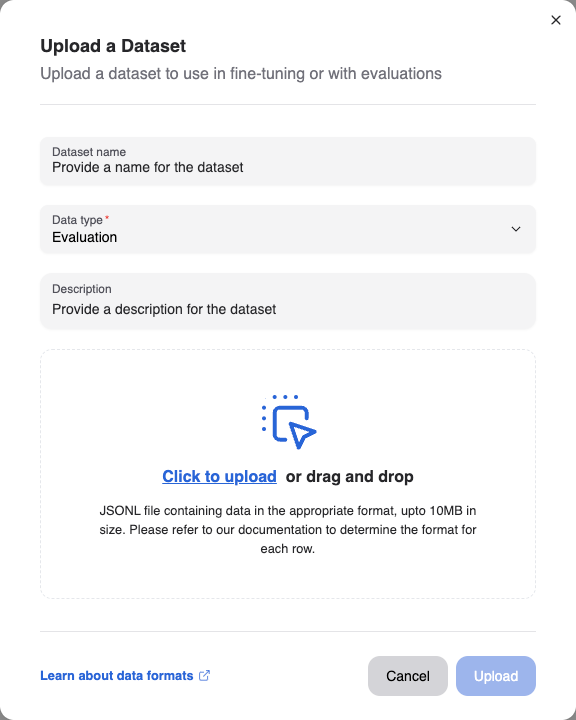
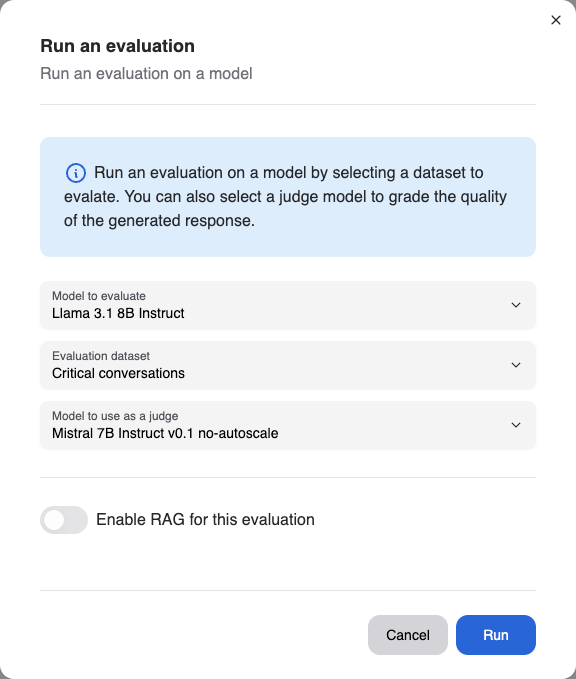
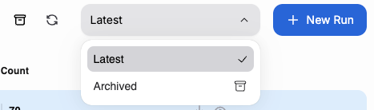

# Evaluation

As with any piece of complex software, comprehensive testing and evaluation is key to ensuring that the model performs as expected. We provide a set of tools to help you evaluate the performance of your model.
The evaluation framework allows you to ensure that the models that you own perform as you expect against metrics that you define.

SiloGen employs LLM-as-a-judge (https://arxiv.org/abs/2306.05685) to perform evaluations of models.

## Getting ready to evaluate your model

### Uploading fine-tuning data

The first step to evaluating your model(s) is to upload evaluation data to our platform. The evaluation data should represent conversations, including indicative responses from the model, which you would like to compare against the actual responses.
Once you have procured training data for your model, navigate to the [Datasets page](https://chat.services.silogen.ai/console/datasets) of the developer console to upload the dataset.

We currently support uploading datasets in a JSONL format, where each row represents a separate chat conversation, including the models' expected response. The format of each row should correspond to what is defined in our [API](https://catalog.services.silogen.ai/redoc#tag/Datasets/operation/add_data_points) for each datapoint, of type ChatWithResponse.

Subsequently, click the "Upload" button and drop your JSONL file in with a name and description

## Running the evaluation

Once you have uploaded the evaluation dataset, you can trigger an evaluation run by navigating to the [Evaluations page](https://chat.services.silogen.ai/console/evaluations) of the developer console and clicking the "New Run" button.

You can select the model that you would like to evaluate, the dataset you would like to evaluate it against, and the model you would like to use as a judge for the evaluation.
If you are evaluating fine-tuned adapters, please make sure to have deployed the adapter before triggering the evaluation.

Currently, you cannot control the prompt used by the judge model to evaluate the models' responses.

You can optionally also control if you would like to enable RAG for the evaluation: Enabling RAG will in effect, evaluate the combined pipeline of both the "Retrieval" and "Generation" components of the platform and model respectively. This is useful if you would like to evaluate the performance of the entire pipeline, rather than just the model.

Depending on the size of the dataset, the evaluation can take a few minutes to complete.

## Viewing the evaluation results

Once the evaluation run has completed, you can view the results by navigating to the Evaluations page and clicking on the evaluation run that you would like to view.
You will be greeted with a summary of the evaluation run: the model evaluated, the dataset used, and the judge model used (including the prompt used by the judge model) and aggregated scores for the evaluation.

### Downloading evaluation results

If you would like to investigate the models' responses for each data point in more detail, you can download the evaluation results in a JSONL format by clicking the "Download" icon at the end of the row.

## Archiving evaluation runs

If you are no longer interested in an evaluation run, you can archive the run by selecting the run and clicking the "Archive" button in the top toolbar. This will move the evaluation run to the "Archived" dropdown and remove it from the main view.
You can view archived runs by selecting runs with the "Archived" filter and "un-archive" the runs as needed.

