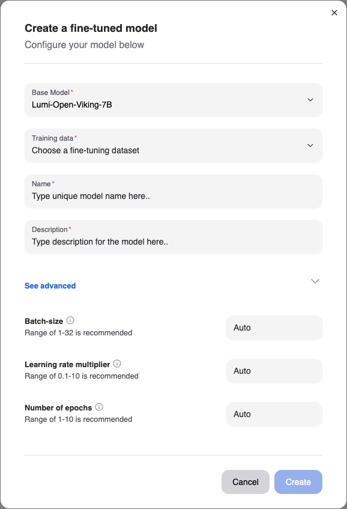
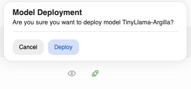
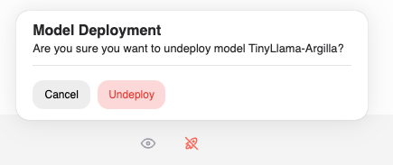

# Fine-tuning

Fine-tuning a model allows you to customize it to your specific use-case with your data. We provide a certified list of base-models which you can finetune and we allow you to customize certain hyperparameters to get the best results.

Fine-tuned models can be deployed and subsequently be used for evaluation and inferencing once weights for the model have been computed.

## Getting ready to finetune your model

### Uploading training data

One of the first steps to take towards fine-tuning your model is to upload training data to our platform.
The training data should represent a wide range of indicative conversations that you would like your model to respond to as part of inference.

Once you have procured training data for your model, navigate to the [Datasets page](https://chat.services.silogen.ai/console/datasets) of the developer console to upload the dataset.
We currently support uploading datasets in a JSONL format, where each row represents a separate chat conversation. The format of each row should correspond to what is defined in our [API](https://catalog.services.silogen.ai/redoc#tag/Datasets/operation/add_data_point) for each datapoint, of type ChatConversation.

Subsequently, click the "Upload" button and drop your JSONL file in with a name and description

### Base-models for finetuning

We are continuously working on certifying base-models for fine-tuning. It is recommended that you first identify a base-model appropriate for your use case and use that for fine-tuning.
If you are missing a specific base-model, reach out to our customer success team in order for them to either provision access, or fast-track certification.
You can browse the list of accessible base-models by navigating back to the [Models page](https://chat.services.silogen.ai/console/models) in the Developer console and clicking the "Create New" button.

## Creating a fine-tuned model

Once you have selected a dataset and a base-model for finetuning, trigger the creation of your fine-tuned model by clicking the "Create New" button and selecting appropriate entries.
You must provide your model a name and a description and can optionally specify any of 3 hyperparameters: Batch-size, Learning-rate multiplier and Number of epochs. If you are unsure of the values to use, leave the inputs empty, to auto select the default certified values.

Once the fine-tuning process has successfully been triggered, you will be able to see your model in the "Not-deployed" tab of the page and the fine-tuning run itself in the "Run status" section.
The finetuning run may take several hours to complete, so we recommend visiting the Developer console occasionally when the run is in progress. If the run fails mid-way, please reach out to our customer success team, and we will help triage your issue.

## Deploying a fine-tuned model

Once your model has been successfully trained, the model status will reflect as "Ready": this means that the weights have been successfully computed for your model and it can be used for inferencing.

Click the "Deploy button" corresponding the model you would like to deploy, and have it usable for inferencing. Please note that a model once deployed can take upto 5 minutes before it can serve requests.

Once deployed, you can navigate either to the [Chat page](https://chat.services.silogen.ai/console/chat) or the [Compare page](https://chat.services.silogen.ai/console/chat) to converse with the model or the [Evaluations page](https://chat.services.silogen.ai/console/evaluations) to evaluate the performance of your model against a pre-defined evaluation dataset.

After your have verified that your model performs as per expectations, you can copy the name of the model in the Models page, by clicking the "Copy Icon" and use the copied model name for inferencing via the API.

## Undeploying a fine-tuned model

Once you have deployed a version of a fine-tuned model, it might be the case that you subsequently want to "Undeploy" it because it has been superseded by other model. You can do this by again navigating to the [Models page](https://chat.services.silogen.ai/console/models), identifying the model in the list of "Deployed" models and clicking the "Undeploy button".

This will make the model no longer accessible for inferencing.

