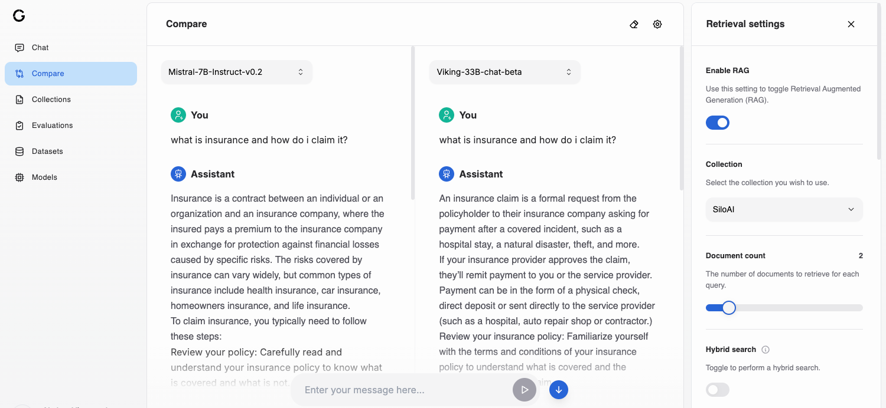

# Playground - Comparison

The Model Comparison page of the playground allows you to compare output of different models, for the same set of settings.

A common use case is to compare the response of your model before and after fine-tuning for the same parameters and test how different settings affect the output of the model.

## Accessing the Playground Model comparison

Navigate to the corresponding page on the [SiloGen Developer Console](https://chat.services.silogen.ai/console/compare) to access the Playground Comparison.

You will be able to choose from the list of models you have access to.

Similar to the Playground Chat, you can expand the settings toggle to view and modify the retrieval and generation parameters.

## Inspecting the debug output of the model

Also [similar to the Playground Chat](./playground-chat.mdx#inspecting-the-debug-output-of-the-model), you can click the "bug" icon to inspect the messages that were sent to the model, the context retrieved as part of RAG and the consumed tokens

.
