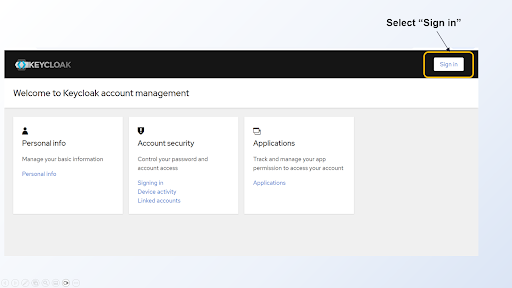

# Editing the Documentation

The documentation is in markdown with the addition of react components (.mdx). More on this below.

The source for both the internal and external documentation exists in the
[silogen/core](https://github.com/silogen/core) repository under `docs/silogen-public-docs/external-docs`
for external docs and `docs/silogen-public-docs/internal-docs` for the internal docs.
People that have permission to access the repo can edit the files in a cloned local repository and then commit
and create a pull request for review as usual.

## Online Editing

For those that don't have access to the repo there is the possibility
to edit the contents of both the internal and external documentation from our online content management system
TinaCMS. You will need an account
for this and you can get one by asking in the developer channel on Slack. Then head over to
[the admin page](https://internal-docs.services.silogen.ai/admin) to edit. Every edit you save will result in a
commit on the `docs-edits` branch of the repo. When you finish editing you have to tell someone with access
to the repository to create a PR and do the review. Once a PR is merged, the external documentation is automatically
updated online. The internal documentation is updated when the internal-docs service is re-deployed.

## Editing tips

### React components

Pages can contain react components. Here is an example:

```
<Admonition type="danger" title="danger: This is an admonition title">
  This is the admonition text.
</Admonition>
```

<Admonition type="danger" title="danger: This is an admonition title">
  This is the admonition text.
</Admonition>
This is an example of an admonition. There are 5 types of admonitions: note,
tip, info, warning, danger. You can also [create your own
components](https://tina.io/docs/extending-tina/custom-field-components/) if you
like.

### Images

<Admonition type="info" title="About images">
  Our online editing tool currently does not support uploading files. The
  work-around is to create the link in the document online and then commit the
  image in the repo.
</Admonition>

You can add an image like this:

```

_Figure 1. Keycloak account manager: https://auth.services.silogen.ai/realms/silogen/account/_
```

The image link starts with the exclamation mark and then references an image in the img directory under `docs`. The
full path in the silogen/core repo would be docs/silogen-public-docs/internal-docs/docs/img.


_Figure 1. Keycloak account manager: https://auth.services.silogen.ai/realms/silogen/account/_

As you can see, the image is centered thanks to some custom CSS.
